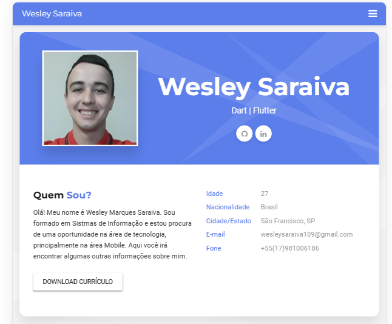

# Passo a Passo como criar um README.MD

# Nome do seu projeto

> Um resumo curto sobre o que o seu projeto faz

Um ou dois parágrafos sobre seu projeto e o que ele faz.



## Instalação

Mac OS x & Linux

```sh
npm install --save
```

Windows:

```sh
edit autoexec.bat
```

## Exemplo de uso

Alguns exemplos que motivam as pessoas a utilizarem seu projeto ou que demostrasse que este é útil para alguma coisa. Divida esta parte em partes menores e se possivel coloque algum codico ou prints de telas.

### Ambiente de Desenvolvimento

Descrever como instalar e preparar qualquer dependencia de desenvolvimento para seu projeto possa ser executado localmente a pessoas possam contribuir com o mesmo. Se possivel forneça as informações para diferentes plataformas como , Windows, Mac OS, Linux.

### Historico de Atualizações

- 0.2.1
  - CHANGE:Atulização dos docs(O codico não foi alterado)
- 0.2.0
  - CHANGE: Removida a função `setPadrao()`
  - ADD: Adicionado nova função `inicializar()`
- 0.1.1
  - FIX: Crash quando executava `escrever()` (Obrigado ao @Cotribuidor)
- 0.1.0
  - o primeiro lançamento estavel
  - CHANGE: Renomeado de `Projeto Curriculo Geek` para
    `Projeto Curriculo Online`
- 0.0.1
  - Projeto Inicial

### Meta

Wesley Marques Saraiva - [@Linkedlin](https://www.linkedin.com/in/wesley-marques-saraiva/)
Distribuido sobre a licença. Veja `LICENÇA` para mais informações.
Projeto:[Curriculo Online](https://wesley-saraiva.github.io/#home)
